========================================================================

**Primero CPIMS User Guide**

**Release 1.1.0**

November 2015

***Prepared for:***

 {#section-1}
======================================================================================

3 United Nations Plaza

New York, NY 10017

 

> ***Prepared by:***

{#section-1}
======================================================================================

Quoin, Inc.

186 South Street, Suite 600

Boston, MA 02111

Introduction
============

The CPIMS+ Module is a data entry, reporting, and case management tool
to help you assess and react to information on child protection issues
and concerns. There is a standard set of forms set forth by the Steering
Committee(s) that we recommend using, however your Site Administrator
may have configured these forms specific to your location and needs. For
any questions about the forms and information you have or need, please
reach out to your Site Administrator.

Logging In
----------

Logging into Primero and you’ll see a Username and Password boxes. Click
in the Username box and type in your unique user name provided to you.
Then enter your password in the field below.

Navigating Primero
==================

Header Navigation Bar
---------------------

The header navigation is the dark bar across the top of the screen in
which you navigate to your home page (or dashboard), Cases, Tracing
Requests, and Reports. It also has a quick search field that can help
you find a specific case quickly. Your current page will be highlighted.
See below:

Dashboard
---------

The Dashboard, or Home Page, is where you can find most of the relevant
and significant information for your cases and tracing requests. It
contains a number of different features, including caseload summaries,
recently flagged cases, etc. The items you see on your Dashboard Page,
however, will vary depending on your user account and its role. Any user
whose role has access to cases will see one of the three cases
dashboards, and any user whose role has access to incidents through the
GBV module will see the GBV Incident Dashboard.

Note that there are a few scenarios in which the user will not see any
dashboards: first, if a user is assigned to a module that has access to
neither cases nor incidents; or second, if a user is assigned to a
module that has access to incidents, but which is not part of the GBV
module. Since both of these scenarios involve the use of modules which
are not in the seed data, administrators should take note of this
possibility when they are creating their own modules.

### Case Dashboards

If your user has access to cases through either the CP or GBV module,
you will see one--and only one--of the following three case dashboards.

#### Cases Dashboard

The most basic view you can see is the Cases Dashboard. If you have any
access to cases, but no status as a manager or administrator, you will
see this dashboard. Here, three sections appear. The first lists your
total cases, as well as the number of *new* cases. (In this case, “new”
means anything which has not been edited since its creation.) The second
lists out cases by high, medium, and low assessment levels, and, once
again, dividing these between total and “new.” The final section gives
the total number of referrals along with new referrals.

#### Manager Dashboard

The Manager Dashboard, meanwhile, appears if your user has been
designated as a manager. This dashboard does basically the same thing
that the Cases Dashboard does, but for the cases owned by people in your
user group(s). The first section tells the number of total and new cases
you have. The next section lists the total and new cases that each of
your managed users has. Below that is a list of the total and new
referrals for each of your managed users. The final section breaks down
the number of cases you have by assessment level. As mentioned before,
if you see the Manager Dashboard, you will not see the standard Cases
Dashboard. A single user can only have one of the case dashboards
display on their Dashboard Page.

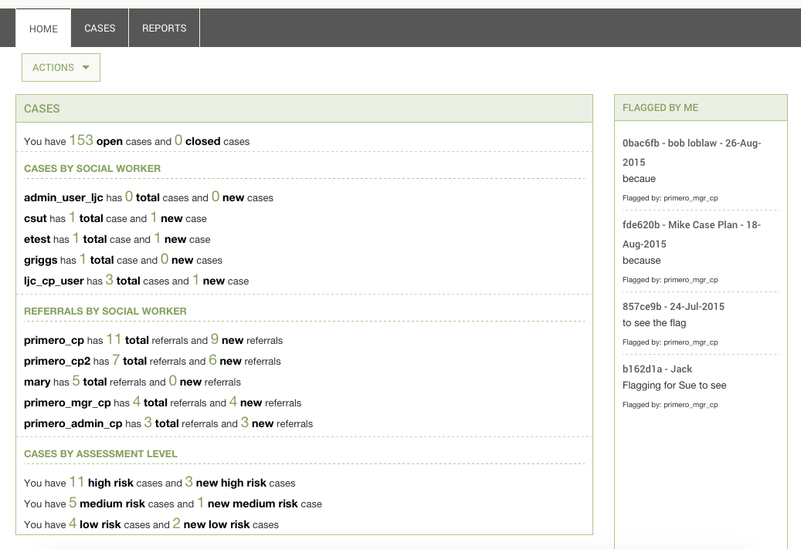

Once again, flagged cases will be on the right hand side of the screen
if you have the Manager Dashboard. However, this time, there will be
only one list of flagged cases, and the cases there will all be flagged
by you. This is because managers often do not have their own cases and
will thus only be concerned with cases which they themselves have
flagged, and which belong to other users.

#### Admin Dashboard

Finally, you will see the Admin Dashboard upon login if your user’s role
has access to all records in the system (thus giving you an
administrator’s functionality). On this dashboard, you will see is a
table of cases by district, with each row broken down into total open
cases, cases created last week, cases created this week, cases closed
last week, and cases closed this week. (Here, a week is measured from
midnight Monday morning to 11:59 Sunday night. This means that for a
case to have been created this week, it must have been created during or
since the immediately preceding Monday morning.) As stated previously,
if you see the Admin Dashboard, you will not see the Cases Dashboard or
the Manager Dashboard, since one user can only have one of the case
dashboards display on their Dashboard Page.

Flags are, once again, on the right. Like the Manager Dashboard, and for
similar reasons, the Admin Dashboard only lists those cases which you
have flagged.

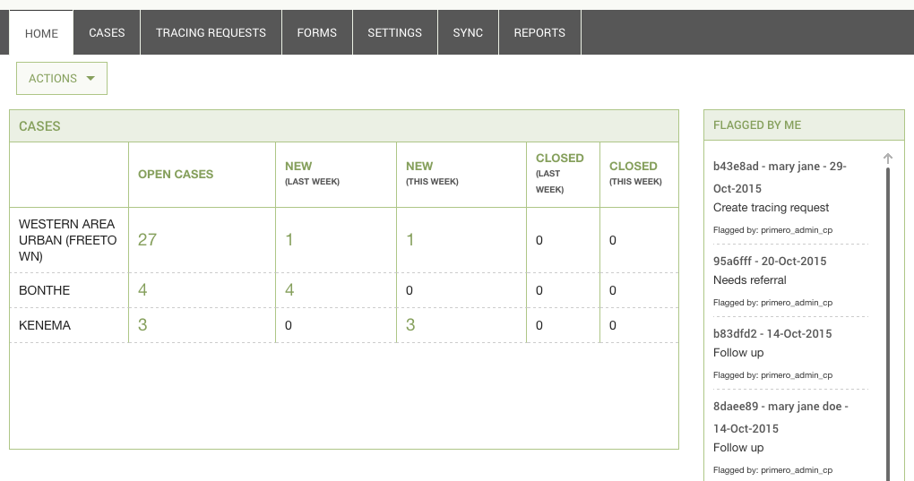

### Flagged Case Lists

If you see any of the case dashboards, the right of your screen will
show one or two two lists of flagged cases. These lists will keep you
reminded of what work you need to do on which cases. The first list,
shown above, consists of the cases which you have flagged most recently,
and will display regardless of whether you have the Case, Manager, or
Admin Dashboard. The second list, shown below, is a list of cases owned
by you which someone else has flagged, and only displays for the Cases
and Admin Dashboards. (Since managers often do not even have the ability
to make cases, it makes no sense for them to have a list of flagged
cases which they own.)

### GBV Incident Dashboard

The GBV Incident Dashboard will appear below whichever case dashboard
you have if your user’s role has access to incidents through the GBV
module. The table in this dashboard lists out each incident, with
columns for “Incident \#ID,” “Date of Interview,” “Date of Incident,”
and “Violence Type.” Each incident’s id will link to the incident’s
page, and each incident will feature an icon indicating the number of
flags it has, provided it has at least one. To the right of the GBV
Incident Dashboard will be a list of incidents flagged by the user.

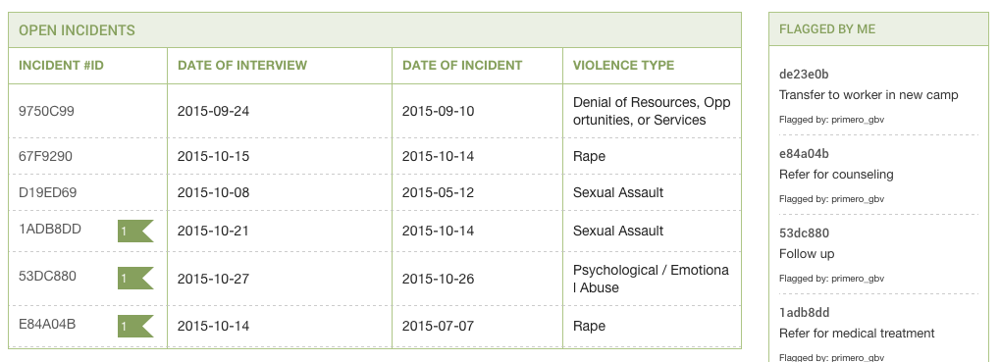

List View
---------

When selecting the record type or page you want to visit via the header
navigation, you can see all cases or tracing requests that belong to you
when you click on CASES. Once there, you see a list of the possible
matching records, that you are able to filter and/or sort. See below:

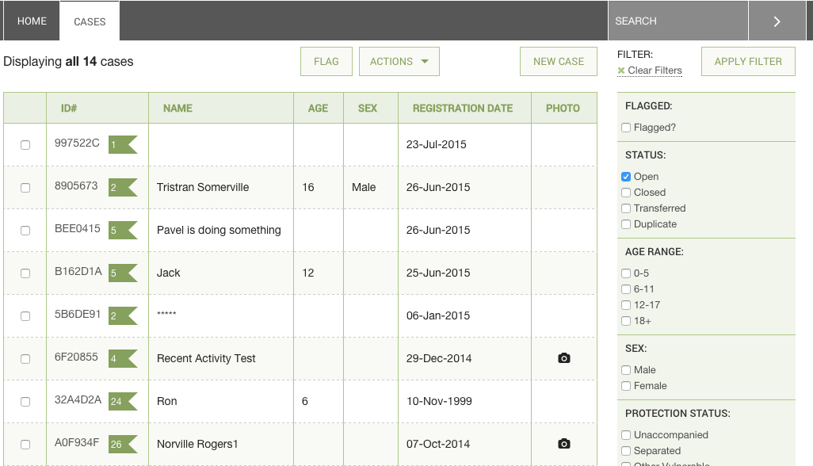

Edit and View a record
----------------------

When creating a new record, you automatically are brought to the “Edit”
page for that record. You can enter in all the relevant information you
need at this time and save when done.

When selecting an existing record, you are brought to “View” the record.
This means you can view all the data and forms you have permission to,
but cannot edit. You must click the Edit button in the Action Buttons
section of the header to change any information that is currently
represented.

Action Buttons 
---------------

Our Action Buttons are the buttons just below our Header Navigation,
which allow a user to act on a case or cases. The actions, depending on
your permissions, are:

-   Flagging

-   Export

-   Import (List View)

-   Transfer

-   Refer

-   Save (edit view only)

-   Cancel (edit view only)

-   Mark for mobile

-   Un-mark for mobile

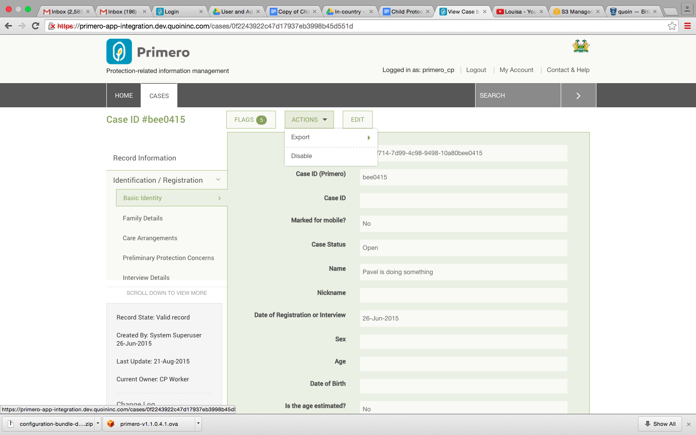

This bar, along with the Header Navigation bar, are part of what is
called the **Anchored Header**, meaning, they never leave the screen
when scrolling. This allows a user to easily navigate or act on a case
or number of cases at any time.

My Account and Contact & Help links
-----------------------------------

Above the Header Navigation bar, there are small links that bring you to
pages that help you manage your account and contact information, as well
as find out who is your site administrator.

Filtering
=========

Filtering your Case List or search results is an efficient way to narrow
down to the case or cases that need your immediate attention. You can
filter the list to show not only if a case has other characteristics but
contains specific information within those characteristics as well. For
example, you can filter by males only, but you can also filter by
specific Protection Concern, Current Location, and the case registration
date range.

The Filter panel is on visible on search results page or when you click
**CASES** tab in the header. See below:

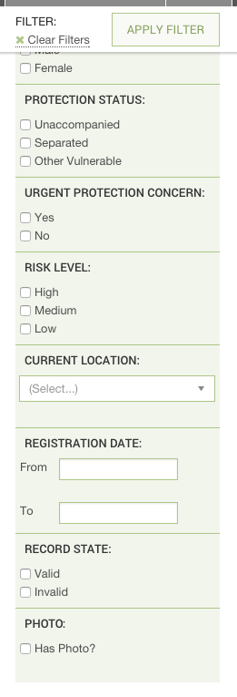

In the image, there is the normal checkbox filter selection, in which
you click using your mouse, but also date range and drop down fields.
For Date Ranges, you can enter these using any of the date field type
actions. You can set the range for one day as well. For the drop down
field, this is clickable with the mouse and you can only select one
value.

Search and Advanced Search
==========================

Quick Search
------------

Quick Search refers to the search field in the header navigation bar.
From here you can type in your search and return a list of possible
matches. If you are searching from the cases page you can enter your
case’s value for one of the following fields to find a match: “Long ID,”
“Case ID,” “Name,” “Nickname,” “Other Name,” “Ration Card Number,” “ICRC
Ref No.,” “RC ID No.,” “UNHCR ID,” “UN Number,” and “Other Agency ID.”
When looking for a tracing request, you can search these fields: “Long
ID,” “Inquirer ID,” “Name of inquirer,” and “Nickname of inquirer.”
After searching, you can filter results further.

Exporting Information on Records
================================

Exporting individual cases or a list of cases can be useful in a number
of ways. This action can be found in the **ACTIONS** header button which
will display a drop down to select what format you want to export - PDF,
XLS, CSV, etc.

  **Format**   **Description**                                                                                                              **Fields Included**
  ------------ ---------------------------------------------------------------------------------------------------------------------------- ------------------------------------------------------------------------
  CSV          Stands for “Comma-Separated Values.” Readable in excel, and can be imported back into any Primero instance.                  All fields to which the user’s role has access.
  Excel        Exports to a standard .xls file, which can be re-imported back into Primero.                                                 All fields to which the user’s role has access.
  JSON         Easiest format to be read by Primero, and the preferred format for importing.                                                All fields to which the user’s role has access.
  Photo Wall   Exports a PDF file with the photo of each selected case along with the case’s ID. Cannot be re-imported into Primero.        Photo, ID.
  PDF          PDF file containing a profile on each case, including the fields from the forms specified by the user. Cannot be imported.   All fields specified by the user, to which the user’s role has access.
  UNHCR        CSV file specifically formatted to be compatible with UNHCR’s data import.                                                   All fields to which the user’s role has access.
  Custom       Excel file containing all the fields specified by the user. Can be imported back into Primero.                               All fields specified by the user, to which the user’s role has access.

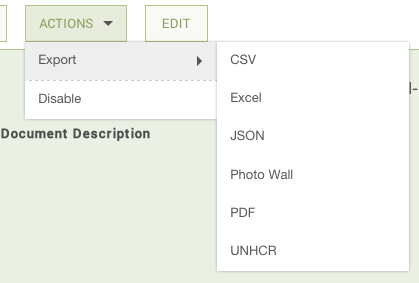

Once you’ve selected your format, the export modal window will appear,
allowing you to set your own password for the file, and name the file
accordingly.

To export a list of cases, while in the case list view, you can select
as many as you’d like to export via the check boxes:

{width="1.0520833333333333in" height="1.75in"}

To export all cases, you can leave all unchecked and it will export all
cases you have access to.

To export a single case, you can either check only that case in the case
list, or enter into the case to view it, then use the ACTIONS button to
export.

Creating a New Case 
====================

When creating a new case, the process is fairly simple. In the Actions
Buttons area of the header there is a “New Case” button that will open
up the forms to enter information. See the “New Case”button below:

Once in the forms, you can navigate to different forms as we describe in
the “Navigating Primero Forms”section

Navigating Primero Forms
========================

Once you are creating or editing a form, you will see a navigation list
in the left panel. This list is an organized way to navigate through
your forms. The initial titles you see are called **Form Groups** and
are set up by your site administrator. The current form you are on will
be highlighted - see below:

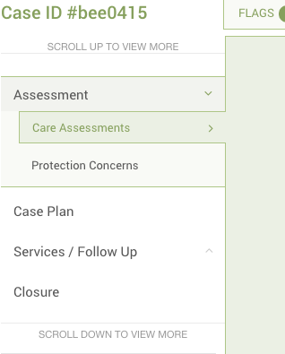

If a Form Group has only one form, you can simply click on it and it
will populate the form. If it has more than one, you can click on the
Form Group name or the expand icon to the right of the name to expand it
and see all the forms in the group. Once expanded you can then click on
any of the form names to enter into the chosen form. For example, in the
image above, the user has selected the “Assessment” form group and the
“Care Assessments” form.

### Navigating Sub-Forms

In certain data sets and forms, we find that information pertaining to
an event or entity is nearly identical. For example, information on
specific family members can be the same form, just labeled per family
member name and relationship. So in cases like this, we’ve designed
these forms as “sub-forms,” and you manually add additional individual
forms to add information on family members, individual follow ups, etc.
To navigate those, there is an expand/collapse function, and an
add/remove function.

Creating, Updating, or Editing a Case
=====================================

Once you’ve entered into the case you would like to update, you must
click the **EDIT** button in the actions header. The page will then
refresh and allow you edit individual form fields.

There are a number of different field types in which you can edit
differently.

-   **Text** - Type normally using your keypad or keyboard.

-   **Text Area** - Similar to the Text field. Type normally, the field
    > expands for more information as you continue to enter information.

-   **Date** - Multiple ways to edit

    -   You can type in a numerical date in the format of dd-mm-yyyy

    -   You can type in the first three letters of the month in the
        > format of 01-Jan-2014

    -   You can use the calendar widget to go to the correct day and
        > select it directly

-   **Check Boxes** - You may click one or many of the options using
    > the mouse.

-   **Tick Box** - You may click on the box using the mouse.

-   **Select Drop Down** - Click any option to select it.**Multi-Select
    > Drop Down** - Begin typing and either hit ‘enter’ or click to
    > select multiple options.

-   **Radio Button** - Similar to Tick Box, click on the correct answer
    > using the mouse

-   **Numeric Field** - Key the number into the field.

-   **Tally Field** - Key in the number you need for each tally. The
    > total automatically calculates based on the tally fields and is
    > not editable in itself.

When you attempt to save, there is always the possibility that one or
more of the fields you entered will be formatted incorrectly. For
instance, if you try to fill in the “Date of Birth” field--which is
supposed to be a format-specific date--with the words, “a pretty long
time ago,” Primero will be unable to save the information. In that case,
after you hit the “save” button, the case will fail to update with your
new information, and the “Date of Birth” field’s label will be
highlighted in red, to inform you that the field has been entered
incorrectly.

Generating Automatic Follow Ups
===============================

While you are making changes to a case, you can make your job managing
the case easier by having Primero generate reminders to perform a follow
up every two weeks. To do this, click on the “Protection Concerns” Form
Section, under the “Identification / Registration” Form Group and check
the “Generate follow up reminders?” tick box. If you click save, Primero
will automatically create a flag (to be discussed later) on the case for
you, once every two weeks, which will remind you to perform a follow up.

Transfers and Referrals
=======================

Transfers
---------

Transferring a record is a basic form of reassignment. There are some
processes surrounding this for a transfer to a non-Primero individual or
a Primero user outside your instance. But those will be determined by
your organization and the sharing protocol of the organization of the
person you are transferring to.

To transfer a record from either the individual record page or the list
view, use the ACTIONS button in the Action Header to initiate the drop
down of options. Within the options, select “Transfer Case.”

The following modal form will appear and allow you to select options for
your transfer. Consent of the individual (or a consent override) is
generally needed for transfers, although not for those which take place
within the same Primero instance.

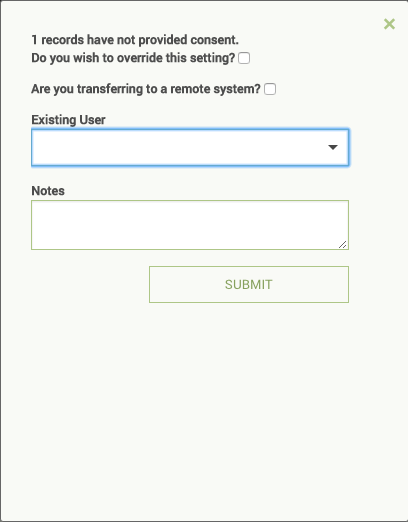

If you are transferring within your Primero instance, select the
“Existing User”--a user within your deployment of Primero. If the
desired user is not in the drop down, it means this user does not have
privileges to be transferred to.

If you are not transferring within the Primero instance, check the “Are
you transferring to a remote system?” tickbox, and more options will
appear for this “remote” transfer. A remote transfer creates a transfer
export that is password protected to be shared outside the system.

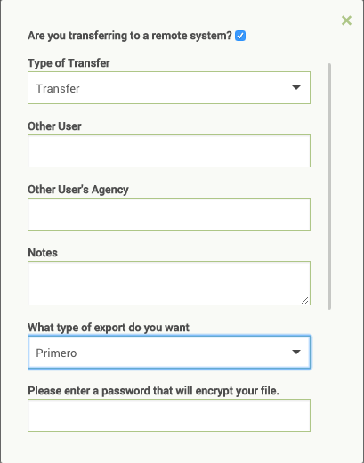

If you are transferring to a user outside your system who is using
another Primero instance, you simply select “Primero” in the drop down
marked “What type of export do you want.” In this case, the file Primero
exports will be a JSON file which can be imported into the remote
Primero system.

> *Note:*
>
> When transferring any such password-protected export/import file, the
> means of sending the file, filename, and the password that opens it,
> will be determined by the Information Sharing Protocol (ISP) decided
> by the appropriate local steering committee. When determining this
> policy, on-the-ground security considerations will be at play, as well
> as the ease and speed of physical transport within the country.

Referrals
---------

Referring a record is a way of giving a user limited access to a record
without transferring it completely. As with transfers, there are some
processes surrounding this action when referring to a non-Primero
individual or a user outside your instance. These processes, however,
will be determined by your organization and the sharing protocol of the
organization of the person you are referring to.

To refer a record from either the individual record page or the list
view, use the ACTIONS button in the Action Header to initiate the drop
down of options. Within the options, select “Refer Case.”

The following modal form will appear and allow you to select options for
your referral. As with transfers, consent (or a consent override) of the
individual is generally required for a referral.

If you are making a referral within your Primero instance, select the
“Existing User”--a user within your deployment of Primero. If the
desired user is not in the drop down, it means this user does not have
privileges to be referred to. You must also select the type of service
that will be rendered by the user to whom you are referring.

If you are not making a referral within the Primero instance, check the
“Are you referring to a remote system?” tickbox, and more options will
appear for this “remote” referral. A remote referral creates a referral
export that is password protected to be shared outside the system.

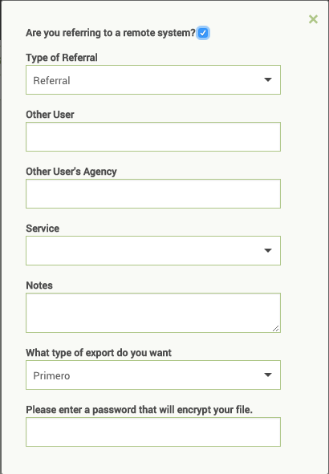

If you are making a referral to a user outside your system who is using
another Primero instance, you simply select “Primero” in the drop down
marked “What type of export do you want.” In this case, the file Primero
exports will be a JSON file which can be imported into the remote
Primero system.

Reports
=======

Reports allow users to see a high-level, aggregate view of data, helping
them to understand trends and coming challenges in their work. Only
certain roles--and thus certain users--will have the ability to create
or view reports. Some users will be able to navigate to the **Reports**
section of the application and view existing reports but not edit them
or create new ones, while others will have the ability to view, create,
edit, and export reports.

Creating a Report
-----------------

To create a report, first click the **Reports** link in the top toolbar.
You will see that there are already a number of pre-built reports which
you can view at any time. To start your own, click the **Create Report**
button at the top of the screen.

When you have reached the new report form, be sure to enter a name and
description for your report. You must then specify the module from which
to draw the records for your report, as well as the type of records you
want to be drawing upon. Here, we have chosen the Child Protection
module, and the Case record type.

Next comes choosing the row and column attributes by which you want your
data to be grouped. The first item you choose in each field will be the
outer grouping layer, with each successive item acting as a
sub-categorization. Taking a look at the example below, we can see that
the columns of our report have been first divided by sex, and then
sub-divided by permanent district/chiefdom, since these are the first
and second “Group by column” attributes, respectively. We can see that
the rows of the report follow the same pattern.

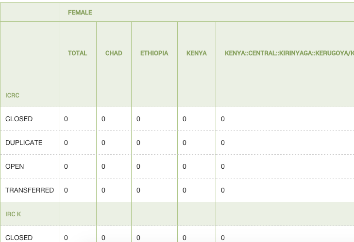

The columns of your report will be augmented by a final “Total” column,
which shows the aggregate for each row. It is important to note that the
numbers in each of your columns may not add up to the number in your
total column, since many attributes will go undefined by the workers
doing registration. For instance, in the example below, three cases with
the “child has been abandoned” protection concern were never assigned a
sex, resulting in a report with one female, no males, and four total
cases.

Furthermore, any reports based on fields within certain nested forms
will automatically count a field for each saved record, even if a nested
form for this field was never filled out. This is because Primero
automatically populates an empty subform on the page for form sections
such as “Protection Concerns,” so that the user can easily enter
information. When a user fails to enter information for that field,
however, the field still counts as a single item. For instance, if you
were to create a case and fail to enter any information into the blank
Protection Concerns subform, a report outlining how many cases had each
type of protection concern would still count your case as having a
single protection concern type, even though you had never entered any
information on the Protection Concerns subform. This would then count
into the total, without counting into the column for any single one of
the protection concern types. Taking a look at the example below, we can
see that, in the Freetown district, one child has been registered as
abandoned and one with a protection concern type of “Extreme levels of
poverty.” But the total number of protection concerns for this district
is three, meaning that one case was registered with a protection concern
form where the protection concern type was never filled in.

After you have defined the row and column attributes for your report,
you will choose the fields from which you will receive an aggregate
count. This feature obviously only works on numeric fields. To give an
example of how it works, imagine we have a report that disaggregates
your cases based on number of children in the family and date of birth
(by year). Three cases end up going into the report: one born in 2004
whose family has three children, one born in 2001 whose family has six
children, and another born in 2001 whose family also has six children.
Here is what the report would normally look like:

As you can see, the 2001 column has the number “2” in the “7” row, since
there are two cases born in 2001 whose families have seven children. We
see this same number in the “Total” column for the “7” row for the same
reasons. If we choose to have aggregate counts on the “Number of
children” field, however, the report would look like this:

Now, instead of seeing that there are two cases that meet the criteria
for being born in 2001 and having a family with seven children, we
instead see the number “14,” representative of fourteen total children.
Once again, this field also shows up in the “Total” column.

### Age Range

The next field, specifying age range, helps make reports involving age
more manageable by grouping them into a smaller list of ranges. The two
images below exemplify the usefulness of this feature. The first shows
part of a sprawling report without age ranges enabled. The second shows
the same report with age ranges.

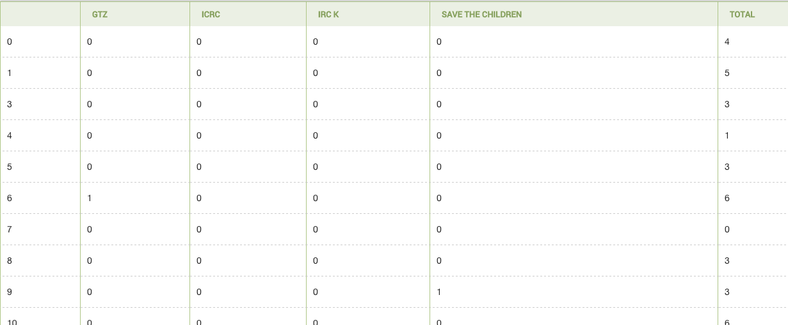

### Date Ranges

The next field, “Use date ranges,” allows you to do much the same thing,
but with date fields instead of ages. Now, instead of having to have a
column for every date over a two year period--as would be the case with
the default, day-long range--you can disaggregate your records by
whether or not they fit into week-, month-, or year-long spans of time.

### Filters

Next, you can put filters on the records you are using to eliminate
irrelevant data. By default, each report filters to include only those
records with a “Case Status” of “Open” and a “Valid Record?” value of
“Yes.” You can create a filter on any single-select, multi-select, tick
box, check box, radio button, number, tally, or date field, and for each
one, you can specify which values are acceptable for records being
included into the report.

Finally, you are asked whether you would like to generate an exportable
graph of your report.

Viewing your reports
--------------------

If you click save on your report, and it saves successfully, you should
arrive at the view page for your report. You will first see a table
representing your report. Above the table, you should see either one or
two tabs. The first, marked “Table,” represents what you currently see.
The second, which will only appear if you specified that your report
should generate a graph, will be marked “Graph” and will show you just
that.

You can also use the **Export** button above the tabs to export either
the data (in CSV form) or the graph (as a .png image file). Below is an
example of a graph generated and then exported from a report.

